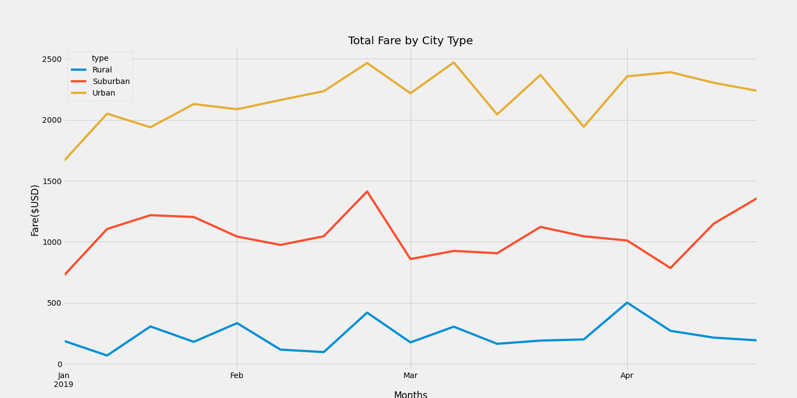

# PyBer_Analysis
## Overview of the Project
### Purpose
The purpose of this analysis was to provide V. Isualize of the ride share company PyBer a summary of ride fares by city type. This information is displayed in a multiple-line graph, accompanied by a written report that summarizes how the data differs by city type and how these differences can be used by decision-makers at PyBer. The code is also included, which can be run to view the summary data. 
### Analysis
#### Results
The results of the analysis are displayed in the multiple line graph below.  The code to create the summary tables and the graph can be seen by clicking the following link. . The main difference in ride sharing data among the different city types is there is significantly more activity as you go from rural areas to suburban to urban. Total drivers, riders and fares are all highest in urban and lowest in rural with suburban making up the middle. The only opposite trend is seen in the average fare per city type. It is lowest in urban areas and highest in rural areas with suburban making up the middle. When this data is examined weekly, as shown in the line graph, there appears to be quite a bit of fluctuation, especially in rural and urban areas, and a little less in suburban areas. If fares are up one week they tend to drop the next week.  
#### Summary
Three recommendations I would make to management to address these disparities:
  * Lower the fare for rural areas. The avg fare is most likely higher here because rides are longer distances, and it becomes cost prohibitive for the consumer. So perhaps just lowering the fare as the length of ride goes up would help entice more riders to take rides which would increase the number of drivers servicing the area which would ultimately increase the total fares coming in. 
  * Increase the number of available drivers in rural and suburban areas, perhaps with some sort of wage incentive to drivers. It's quite possible people simply don't order ride share rides due to lack of drivers, even though they would love a night out on the town.
  * Increase advertising and marketing in rural and suburban areas, both for drivers and riders. Drivers won't want to service the area without riders, and riders won't request rides if there are no drivers. Which comes first is like a chicken and the egg scenario, so both need to be convinced that PyBer is worth using outside of an urban area.
